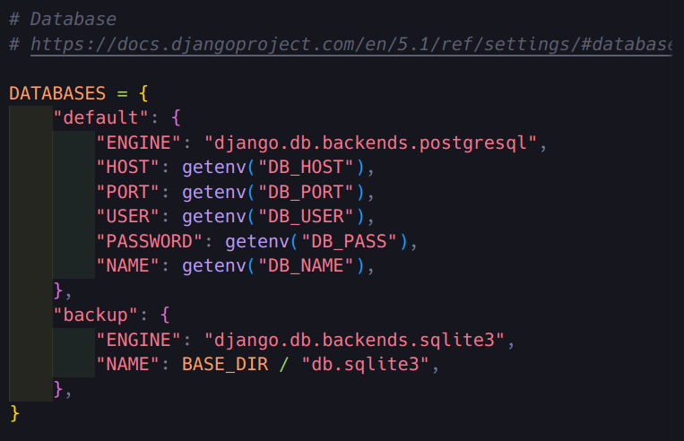

### Simple React App with Django

This project demonstrates how to integrate a React application into a Django backend. The goal is to create a simple CRUD (Create, Read, Update, Delete) system for managing notes.

#### Prerequisites for backend:

1. Create new virtual environment:

- `python3 -m venv myenv`
- `source myenv/bin/activate`

2. Install dependencies:

- `pip install -r requirements.txt`

3. Connect to database:

In this project I am using postgres database. It is hosted through the `choreo.dev` platform. This platform has a free tier. after creating the database on this service, I need to rename the `.env.dist` file to `.env` and set the environment variables.

If you prefer to use a local database ex: `sqlite`. You need to change the `backup` items in the `DATABASES` key in the `backend/backend/settings.py` file to `default`

4. Run migrations:

- `python manage.py migrate`

5. Create superuser:

- `python manage.py createsuperuser`

6. Run server:

- `python manage.py runserver`

- All dependencies installed (backend/requirements.txt):
  - asgiref
  - Django
  - django-cors-headers
  - djangorestframework
  - djangorestframework-simplejwt
  - PyJWT
  - pytz
  - sqlparse
  - psycopg2-binary
  - python-dotenv
